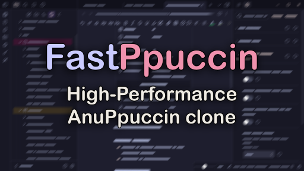
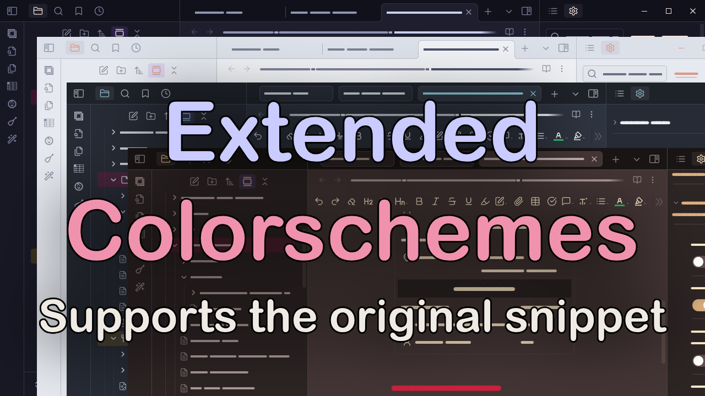

# FastPpuccin

A high-performance clone of the [AnuPpuccin](https://github.com/AnubisNekhet/AnuPpuccin) theme by AnubisNekhet, optimized for speed.

## About

FastPpuccin is a streamlined version of the popular AnuPpuccin theme, designed with performance in mind. It maintains the beautiful aesthetics of the original while removing most features and configurations to achieve maximum speed.

In my testing, performance is comparable to using the default theme.

This theme supports **[AnuPpuccin Themes Extended](https://github.com/AnubisNekhet/AnuPpuccin/blob/main/snippets/extended-colorschemes.css)** (mirror).

## But why?

Like probably most of you reading this, I love Obsidian and spend a lot of time tinkering with it (arguably to the detriment of actual work). AnuPpuccin with Nord Dark is my favorite theme; however, for big vaults and complex notes, it can become so slow that even typing is delayed.

After trying out different themes and snippets, and not satisfied with performance, I started to make my own, copying the best features from AnuPpuccin. What started as a snippet evolved into a complete theme with settings and support for [AnuPpuccin Themes Extended](https://github.com/AnubisNekhet/AnuPpuccin/blob/main/snippets/extended-colorschemes.css) so you can use whatever color scheme you fancy.

Bug reports and feature suggestions are welcome, but keep in mind that I probably won't add features that increase complexity and might hinder performance.

## Features

- High-Performance, with the same great look!
- **Support for [AnuPpuccin Themes Extended](https://github.com/AnubisNekhet/AnuPpuccin/blob/main/snippets/extended-colorschemes.css)** (mirror)
- Core features preserved:
  - Custom checkboxes
  - File icons
  - Colored headings
  - File extension labels alignment
  - Safari-style tabs
  - Table hover transition effect (from [Blue Topaz](https://github.com/PKM-er/Blue-Topaz_Obsidian-css) theme)

## Settings

The theme includes essential settings for customization:

- Light/Dark theme flavor selection
- File name title color options (Normal, Muted, Accent, H1)
- Toggle options for:
  - Custom checkboxes
  - File icons
  - Colored headings
  - File extension label alignment
  - Safari tabs
  - External link icons
  - Table hover transition

## Credits

- Original [AnuPpuccin](https://github.com/AnubisNekhet/AnuPpuccin) theme by AnubisNekhet. Almost all code is lifted from AnuPpuccin, with some minor bug fixes and some hard-coded variables that are required for FastPpuccin.
- Table hover transition from [Blue Topaz](https://github.com/PKM-er/Blue-Topaz_Obsidian-css) theme by PKM-er

## License

This theme is licensed under GPL-3.0, as is the original AnuPpuccin theme.

Blue Topaz is licensed under MIT.

## Support

If you enjoy this theme, consider supporting the *original author*:

If you also want to *support me*, you can do so here:

